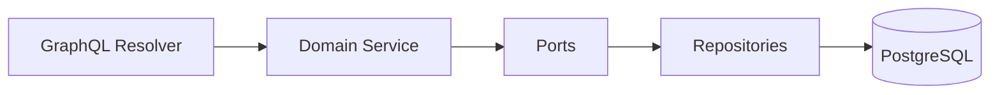
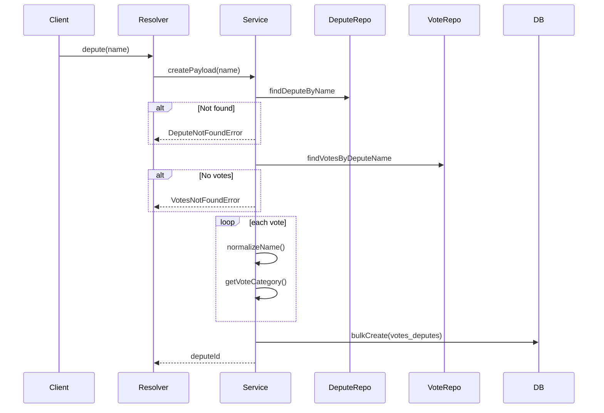
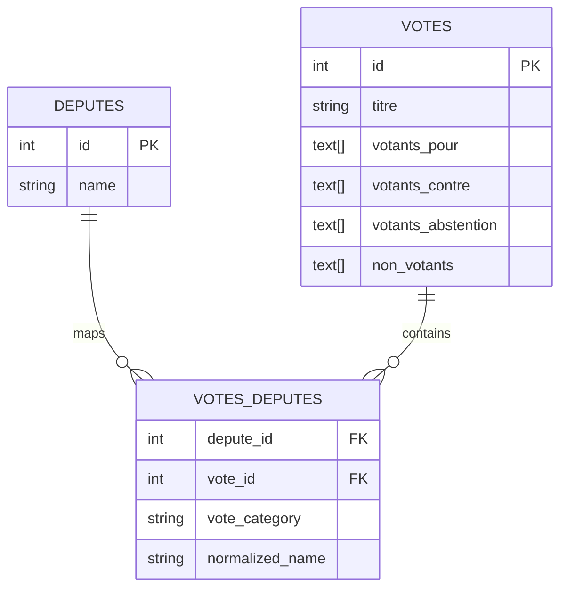
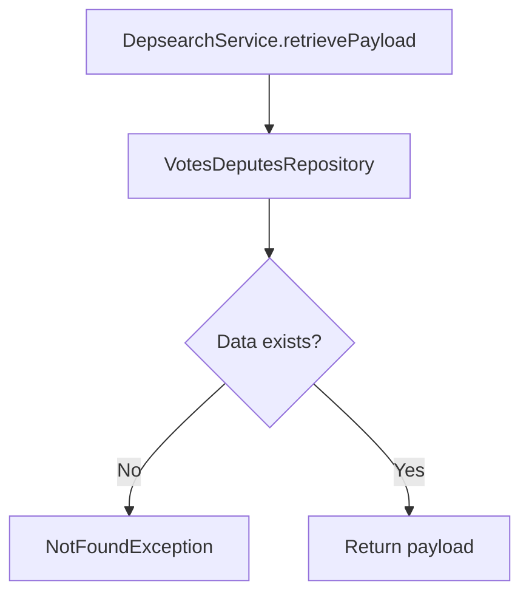

**Functional Specs & Architecture (DeputyTracker Backend)**

This document describes the business logic, hexagonal architecture, and data flow of the DeputyTracker backend.

**Local Setup & Run**
**Prerequisites**

Make sure you have installed:

Node.js (v20+ recommended)
pnpm

Install pnpm if needed:

```bash
npm install -g pnpm
```

**Installation**

Install dependencies:

```bash
pnpm install
```

**Build**

Compile the project:

```bash
pnpm build
```

**Run the application**

Start the development server:

```bash
pnpm run start:dev
```

**Access the API**

Once running, access:

GraphQL Playground:http://localhost:3000/graphql

**System Vision**

The goal is to map parliamentary votes to deputies to provide a structured and queryable view of voting behavior.

| Concept     | Technical Meaning                         |
| :---------- | :---------------------------------------- |
| **Deputy**  | Main domain entity being queried          |
| **Vote**    | Raw data containing arrays of voters      |
| **Mapping** | Computed join between `deputy` and `vote` |
| **Payload** | Structured result exposed via GraphQL     |

**Hexagonal Architecture**

The project follows a Ports & Adapters (Hexagonal) architecture.



| Layer             | Role                           |
| :---------------- | :----------------------------- |
| **Core / Domain** | Pure business logic            |
| **Ports**         | Interfaces (contracts)         |
| **Adapters**      | Implementations (GraphQL + DB) |


**Main Flow (Use Case)**

**Deputy vote ingestion**



    **Core Business Logic**
A. **Name Normalization (normalizeName)**

| Goal                    | Implementation             |
| :---------------------- | :------------------------- |
| Standardize comparisons | lowercase + remove accents |
| Avoid mismatches        | remove spaces and hyphens  |

**B. Vote Category (getVoteCategory)**

| Field Checked        | Result     |
| :------------------- | :--------- |
| `votants_pour`       | POUR       |
| `votants_contre`     | CONTRE     |
| `votants_abstention` | ABSTENTION |
| `non_votants`        | NON_VOTANT |

**C. Payload Construction**

| Step      | Description                |
| :-------- | :------------------------- |
| Extract   | Fetch votes                |
| Transform | Normalize + map            |
| Load      | `bulkCreate` via Sequelize |

**5. Data Model (ERD)**


    **6. GraphQL API**
    
**Main Entry Point**

| Resolver                   | Description                |
| :------------------------- | :------------------------- |
| `DepsearchResolver.depute` | Search + ingest + retrieve |


**Output**

| Type            | Description              |
| :-------------- | :----------------------- |
| `VoteDeputeDto` | GraphQL response payload |


**7. Data Retrieval**



    **8. Key Components**

| Component           | File                       |
| :------------------ | :------------------------- |
| VotesDeputesService | `votes-deputes.service.ts` |


| Repository             | Role              |
| :--------------------- | :---------------- |
| DeputeRepository       | Deputy access     |
| VoteRepository         | Votes access      |
| VotesDeputesRepository | Join table access |


| Error                 | Condition        |
| :-------------------- | :--------------- |
| `DeputeNotFoundError` | Deputy not found |
| `VotesNotFoundError`  | No votes found   |


**9. Persistence & Constraints**

| Element     | Description            |
| :---------- | :--------------------- |
| Table       | `votes_deputes`        |
| Insert      | `bulkCreate`           |
| Primary Key | Composite              |
| Migrations  | Creation + constraints |

**10. Tech Stack**

| Layer   | Tech                        |
| :------ | :-------------------------- |
| Runtime | Node.js + TypeScript        |
| API     | GraphQL (NestJS code-first) |
| ORM     | Sequelize                   |
| DB      | PostgreSQL (Aiven)          |
| CI/CD   | GitHub Actions + Azure      |
